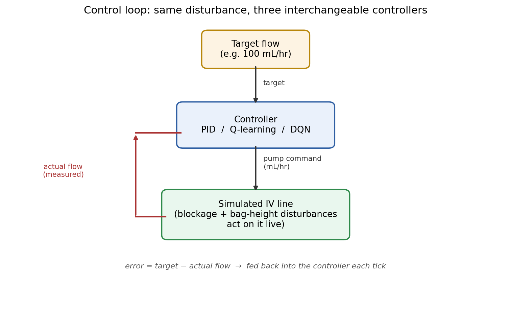
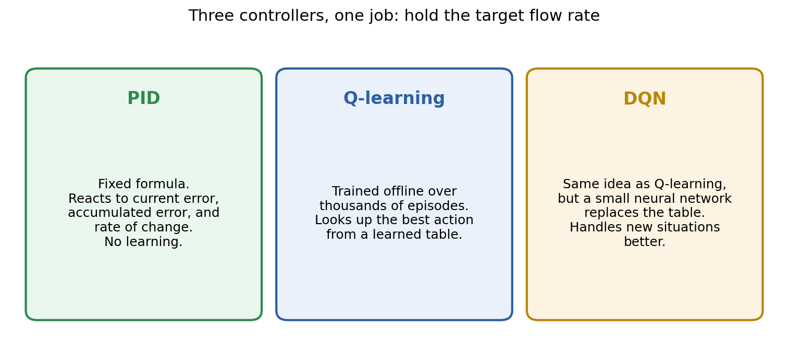

# IV Infusion Flow Control — PID vs Q-learning vs DQN

A simulated IV drip line, controlled three different ways, so you can watch a
classic controller (PID) go head-to-head with two reinforcement-learning
agents (tabular Q-learning and DQN) on the same disturbances.

**Live demo:** https://rl-based-iv-infusion-system-iuvwrgn9zfad2stzipralz.streamlit.app

## What problem is this solving?

An IV pump has one job: deliver fluid at a set rate (mL/hr), no matter what.
In reality, two things fight against it:

- **A blocked line** (kinked tube, arm position) — the pump commands flow,
  but only a fraction of it gets through.
- **Bag height / arm movement** — pushes flow up or down on its own, even
  when the pump's command hasn't changed.

The question this project asks: **which control strategy holds the target
flow rate best when these disturbances hit — a hand-tuned classical
controller, or an agent that learned by trial and error?**

## The control loop, visually



Every fraction of a second, each controller looks at the current error (how
far off target the flow is) and decides a new pump command. The simulated
line reacts to that command *and* to whatever disturbance is active. The
result feeds back as the new error. This loop repeats for the whole episode
— that's what the live chart is plotting, tick by tick.

## The three controllers



No real patient data is used anywhere — the "line" is a physics equation (a
first-order lag with a blockage factor and an external push), and all three
controllers are tested against the *same* simulated line under the *same*
disturbance, so the comparison is fair.

## What you can do on the dashboard

- Set a **target flow rate** and **episode length**.
- Hit **START** and watch all three controllers chase the target live.
- **Simulate a blockage in the flow** — mid-run, drop how much of the
  commanded flow actually gets through (like a kinked line).
- **Simulate a bag or arm movement** — mid-run, push the flow up or down
  directly, independent of the pump's command.
- Watch the **Performance Metrics** table for the trained, statistically
  sound comparison across 30 held-out test runs.

## The honest result

PID wins on most metrics here — and that's a real, useful finding, not a
failure of the RL agents. This plant is close to linear, and PID is exactly
the tool built for that regime. DQN partially closes the gap by tracking the
error more accurately overall; tabular Q-learning is limited by its coarse
lookup table. See `src/environment.py` and `src/evaluate.py` for the full
technical writeup and numbers.

## Project structure

```
src/
  environment.py        # the simulated IV line + disturbance generator
  q_learning_agent.py    # tabular Q-learning
  dqn_agent.py             # neural-network Q-learning
  pid_controller.py       # classical PID baseline
  metrics.py               # IAE / ISE / ITAE / ITSE and other scoring
  train.py                  # trains Q-learning / DQN offline
  evaluate.py               # runs the 30-episode head-to-head comparison
app.py                     # the Streamlit dashboard
results/                    # trained models + saved comparison plots
```

## Running it yourself

```bash
pip install -r requirements.txt
streamlit run app.py
```

To retrain from scratch:

```bash
python -m src.train --episodes 5000 --seed 0
python -m src.evaluate --n_eval 30
```
